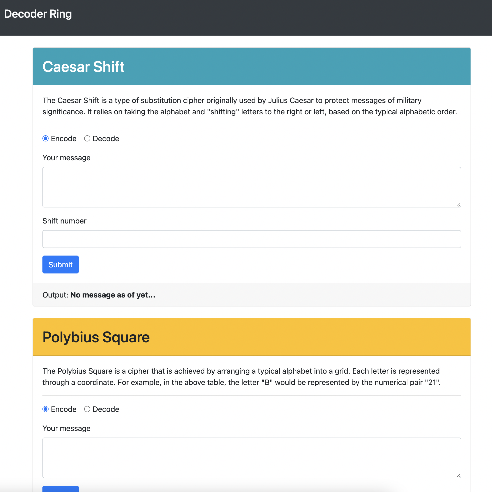

# Decoder-Ring
  
## Description
Sick of people reading your secret messages? Well I have got a doozer for you!. This app allows you to encript and decrypt messages in 3 different methods: The Caesar Shift, The Polibius Square and The Subbstitution Cypher. With this tool only your inner circle will know what the gvdl you are talking about.
## Contents
* [Usage](#usage)
   * [Screenshots](#screenshots)
* [Questions](#questions)

## Usage
clone the repo, install dependencies, run npm start. 
  
### Screenshots

## Built With

* HTML
* CSS
* JavaScript
* Node.js
  
## Questions
If you have any questions about the repo, please [open an issue](https://github.com/Oscarlosg/Decoder-Ring/issues) or contact me via email at oscarlosg14@gmail.com. You can find more of my work on my GitHub, [Oscarlosg](https://github.com/Oscarlosg/).
  

  

